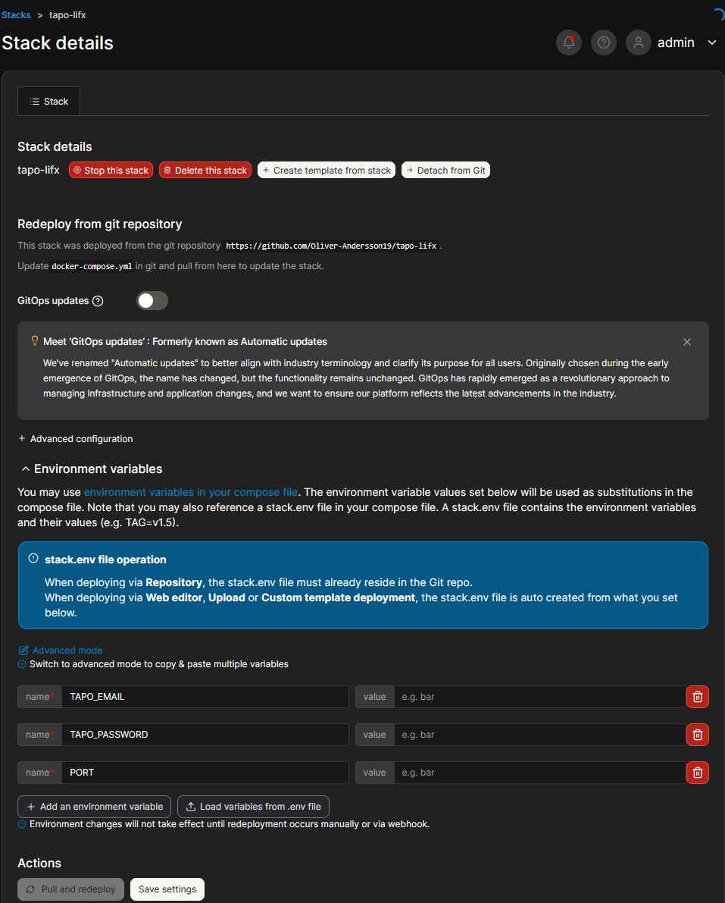

# Tapo Plugs och LIFX Lampor

Lokal styrning av Tapo-plugs och LIFX-lampor via Node.js och Docker.

## Endpoints

**Tapo-plugs** (identifieras via IP)
- `GET /plugs/:ip/status`
- `POST /plugs/:ip/on`
- `POST /plugs/:ip/off`

**LIFX-lampor** (identifieras via ID)
- `GET /lights`
- `GET /lights/:id/status`
- `POST /lights/:id/on`
- `POST /lights/:id/off`

**Övrigt**
- `GET /` — hälsokoll

## Kör i Docker / Portainer

Deploya stacken från detta repo. Miljövariablerna `TAPO_EMAIL`, `TAPO_PASSWORD` och `PORT` fylls i direkt i Portainer (se `img.png`):




## Exempel (curl)

```bash
# Kolla status på en Tapo-plug
curl http://<server-ip>:3000/plugs/<lampa-ip>/status

# Slå på/av en Tapo-plug
curl -X POST http://<server-ip>:3000/plugs/<lampa-ip>/on
curl -X POST http://<server-ip>:3000/plugs/<lampa-ip>/off

# Lista upptäckta LIFX-lampor, ger ID (inte IP addresser)
curl http://<server-ip>:3000/lights

# Slå på/av en LIFX-lampa, använd ID, (inte IP)
curl -X POST http://<server-ip>:3000/lights/<lampa-id>/on
curl -X POST http://<server-ip>:3000/lights/<lampa-id>/off
```